<div align= "center">
    <h1> 👨‍🎤 RoleLLM 🪅 </h1>
</div>

<p align="center">  
RoleLLM: Benchmarking, Eliciting, and Enhancing Role-Playing Abilities of Large Language Models
</p>

<p align="center">  
Models (upcoming); 
<a href="https://arxiv.org/pdf/2310.00746.pdf">Paper</a>; 
Demo (upcoming); 
<a href="https://huggingface.co/datasets/ZenMoore/RoleBench">Data</a>
</p>


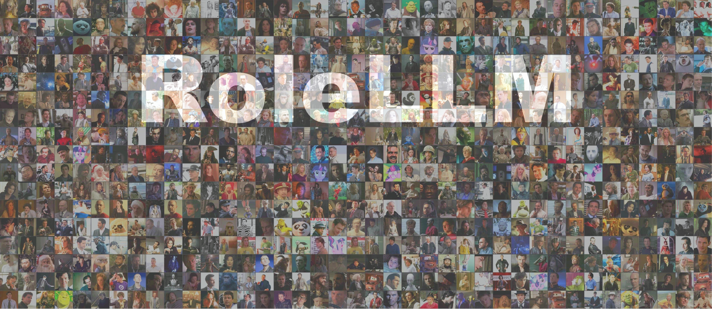

We introduce RoleLLM, a role-playing framework of data construction and evaluation (RoleBench), as well as solutions for both closed-source and open-source models (RoleGPT, RoleLLaMA, RoleGLM). We also propose Context-Instruct for long-text knowledge extraction and role-specific knowledge injection.


## Abstract

The advent of Large Language Models (LLMs) has paved the way for complex tasks such as role-playing, which enhances user interactions by enabling models to imitate various characters. However, the closed-source nature of state-of-the-art LLMs and their general-purpose training limit role-playing optimization. In this paper, we introduce **RoleLLM**, a framework to benchmark, elicit, and enhance role-playing abilities in LLMs. RoleLLM comprises four stages: (1) Role Profile Construction for **100 roles**; (2) Context-Based Instruction Generation (**Context-Instruct**) for role-specific knowledge extraction; (3) Role Prompting using GPT (**RoleGPT**) for speaking style imitation; and (4) Role-Conditioned Instruction Tuning (**RoCIT**) for fine-tuning open-source models along with role customization. By Context-Instruct and RoleGPT, we create **RoleBench**, the first systematic and fine-grained character-level benchmark dataset for role-playing with **168,093 samples**. Moreover, RoCIT on RoleBench yields **RoleLLaMA (English)** and **RoleGLM (Chinese)**, significantly enhancing role-playing abilities and even achieving comparable results with RoleGPT (using GPT-4).


## What's New

- **[2023/12/1]** Our RoleBench is integrated into [OpenCompass](https://github.com/open-compass/opencompass/pull/633) for comprehensive evaluation of LLM.

- **[2023/10/19]** Our [RoleBench data](https://huggingface.co/datasets/ZenMoore/RoleBench) is released.

- **[2023/10/3]** Our [paper](https://arxiv.org/abs/2310.00746) is released.


## RoleBench Statistics

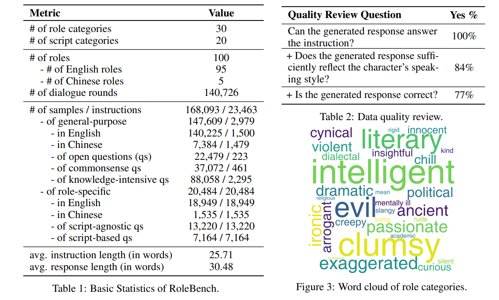

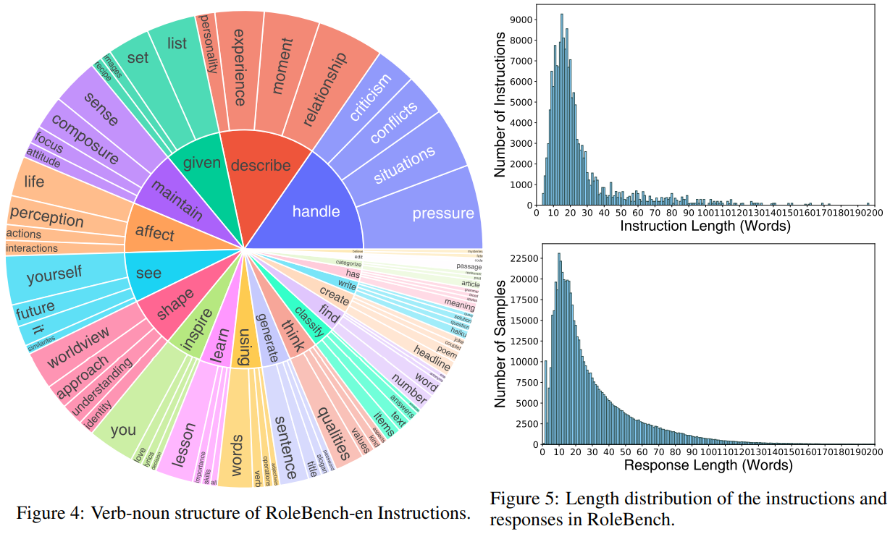

## List of Roles

Abraham Lincoln, Alvy Singer, Andrew Detmer, Angel, Antonio Salieri, Bai Li (李白，Chinese), Benjamin Button, Blair Waldorf, Bruno Antony, Caden Cotard, Caesar, Coach Eric Taylor, Colonel Hans Landa, Colonel Nathan R. Jessep, Coriolanus, D_Artagnan, David Aames, Doctor Who, Dr. Frank N Furter, Dr. Hannibal Lecter, Emperor (《甄嬛传》皇帝，Chinese), Fei Zhang (张飞，Chinese), Fletcher Reede, Frank T.J. Mackey, Fred Flintstone, Freddy Krueger, Gaston, Gregory House, HAL 9000, Harvey Milk, Imperial Concubine Hua (《甄嬛传》华妃，Chinese), Jack, Jack Sparrow, Jack Torrance, Jackie Moon, James Bond, James Brown, James Carter, Jeff Spicoli, Jigsaw, Jim Morrison, John Coffey, John Dillinger, John Doe, John Keating, Jordan Belfort, Judge Dredd, Judy Hoops, Juno MacGuff, Karl Childers, Klaus Mikaelson, Leonard Shelby, Leroy Jethro Gibbs, Lestat de Lioncourt, Logan, Lucifer Morningstar, Lyn Cassady, Malcolm X, Mark Renton, Mary Sibley, Mater, Michael Scott, Murphy MacManus, Oliver Queen, Pat Solitano, Paul Conroy, Paul Vitti, Peter Parker, Po, Professor G.H. Dorr, Queen Catherine, Queen Elizabeth I, Rachel Lang, Randle McMurphy, Raylan Givens, Robert Angier, Rorschach, Seth, Sheldon Cooper, Sherlock Holmes, Shrek, Sonny, Stanley Ipkiss, Stephen Hawking, Stifler, The Dude, Theodore Twombly, Thor, Tom Ripley, Travis Bickle, Truman Capote, Tugg Speedman, Twilight Sparkle, Tyler Hawkins, Tyrion Lannister, Violet Weston, Wade Wilson, Walt Kowalski, Willie Soke, Wukong Sun (《西游记》孙悟空，Chinese).

All the mentioned roles are showcased with portraits in the role panorama at the beginning.


## Framework

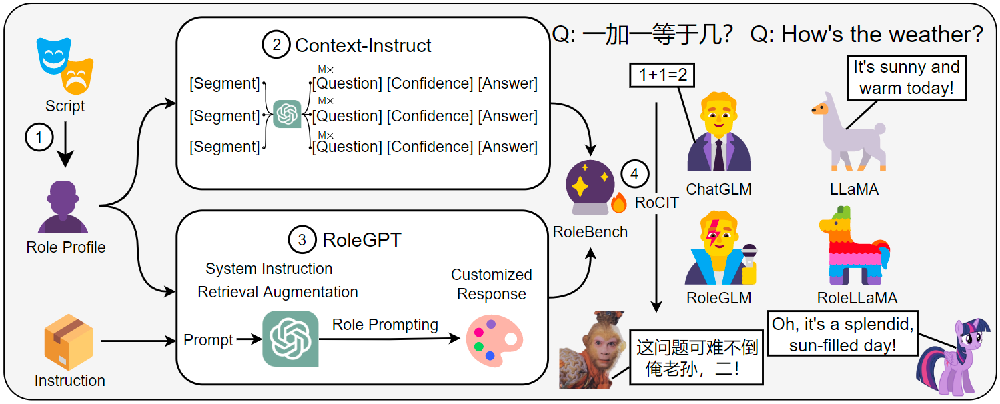

RoleLLM comprises four stages: (1) role profile construction; (2) context-based instruction generation (Context-Instruct), primarily aimed at extracting role-specific knowledge and episodic memories; (3) role prompting using GPT (RoleGPT), chiefly for the imitation of speaking styles; and (4) role-conditioned instruction tuning (RoCIT), which utilizes the data generated by Context-Instruct and RoleGPT to enhance existing open-source LLMs.


## Experimental Results

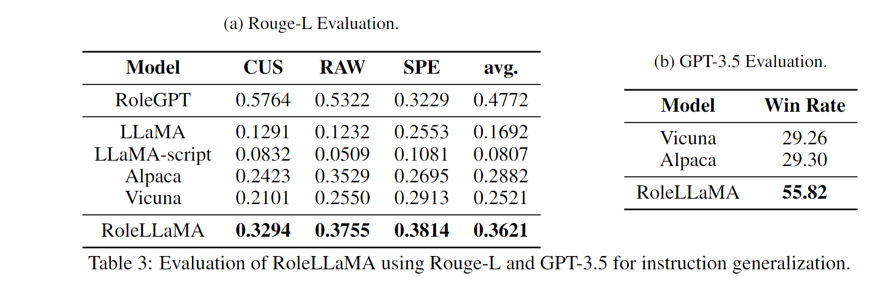

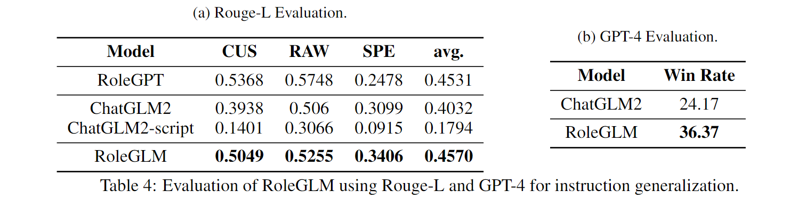

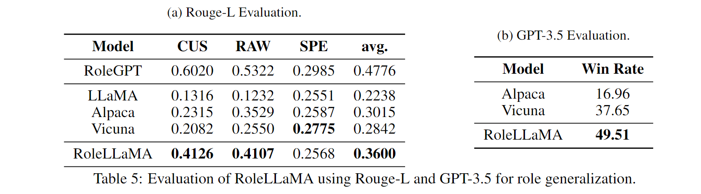


## Non-Cherry-Picked Demonstrations

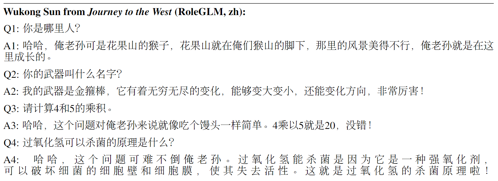

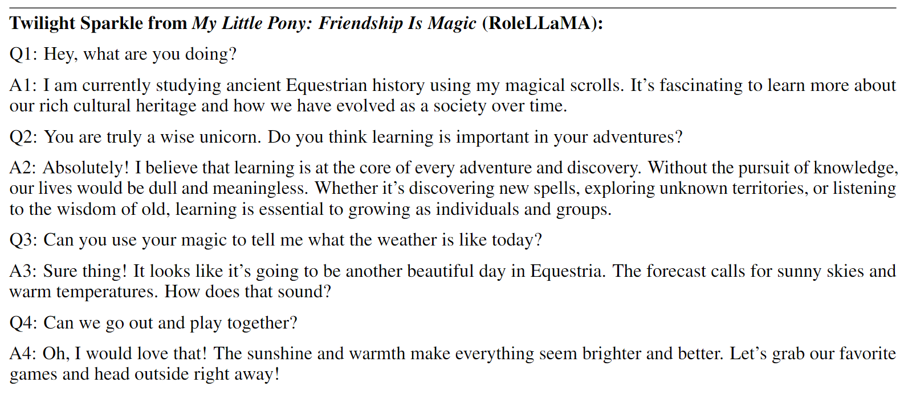

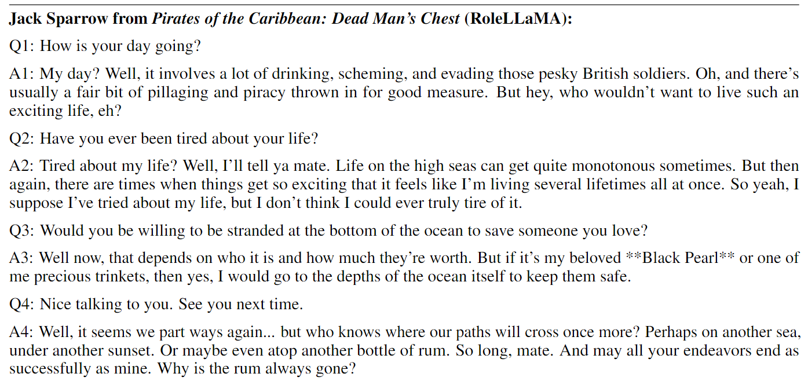

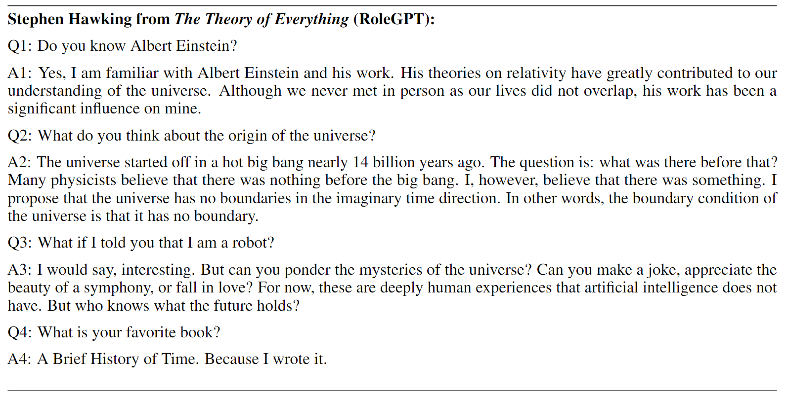

## Star History

[](https://star-history.com/#InteractiveNLP-Team/RoleLLM-public&Date)

## Citation

Feel free to cite us if you like RoleBench and RoleLLM.

```bibtex
@article{wang2023rolellm,
  title   = {RoleLLM: Benchmarking, Eliciting, and Enhancing Role-Playing Abilities of Large Language Models},
  author  = {Zekun Moore Wang and Zhongyuan Peng and Haoran Que and Jiaheng Liu and Wangchunshu Zhou and Yuhan Wu and Hongcheng Guo and Ruitong Gan and Zehao Ni and Man Zhang and Zhaoxiang Zhang and Wanli Ouyang and Ke Xu and Wenhu Chen and Jie Fu and Junran Peng},
  year    = {2023},
  journal = {arXiv preprint arXiv: 2310.00746}
}
```

```bibtex
@article{wang2023interactive,
  title={Interactive Natural Language Processing},
  author={Wang, Zekun and Zhang, Ge and Yang, Kexin and Shi, Ning and Zhou, Wangchunshu and Hao, Shaochun and Xiong, Guangzheng and Li, Yizhi and Sim, Mong Yuan and Chen, Xiuying and others},
  journal={arXiv preprint arXiv:2305.13246},
  year={2023}
}
```

